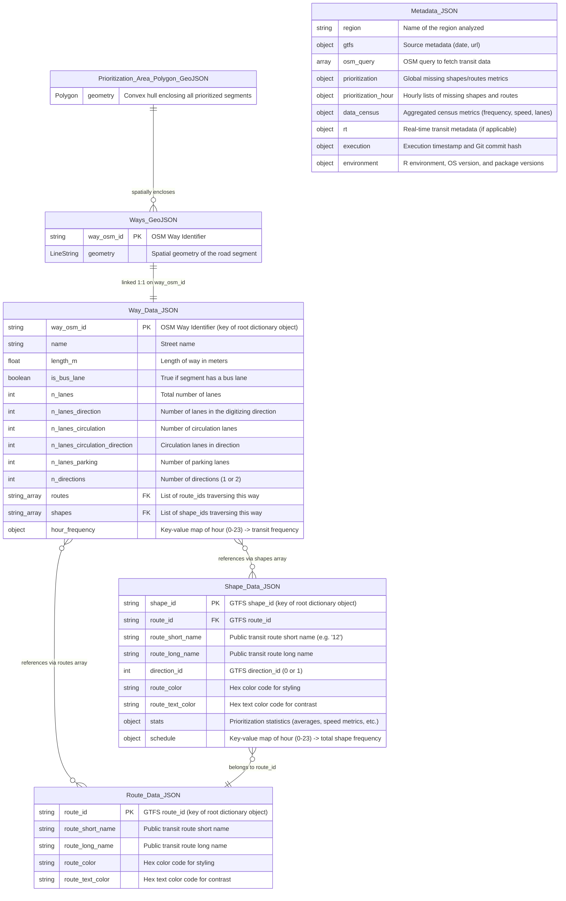

# Relational Model of Generated JSON and GeoJSON Files

This document describes the structure and relationships of the JSON and GeoJSON files generated by the `prioritize.R` script. These files contain processed public transit (GTFS) and road network (OSM) data ready for ingestion by the web dashboard.

## Overview of Generated Files

All generated files reside in the output directory structure:
`web_data/<region_name>/gtfs_<gtfs_day_without_dashes>/run_<timestamp>/`

The files generated with `.json` and `.geojson` extensions are:
1. **`prioritization_area_polygon_<region>_gtfs<date>_run<date>.geojson`**: Enclosing bounding polygon.
2. **`ways_<region>_gtfs<date>_run<date>.geojson`**: Road network geometries.
3. **`way_data_<region>_gtfs<date>_run<date>.json`**: Speed, lanes, and hourly frequencies for road segments.
4. **`shape_data_<region>_gtfs<date>_run<date>.json`**: Transit shape metrics, attributes, and hourly schedule frequencies.
5. **`route_data_<region>_gtfs<date>_run<date>.json`**: Transit route metadata.
6. **`metadata_<region>_gtfs<date>_run<date>.json`**: Global pipeline execution metrics, census stats, and configurations.

---

## Entity-Relationship (ER) Diagram

The following Mermaid ER diagram shows the relational schema, key fields, and associations between these files:

---

## Detailed Relationships & Key Mappings

### 1. Spatial Relationship (Bounding Polygon to Road Segments)
* **`prioritization_area_polygon_<...>.geojson`** contains the convex hull encompassing all geometries found in **`ways_<...>.geojson`**.
* This is a spatial relationship (containment) rather than a relational key constraint.

### 2. Way Geometry to Way Data
* **`ways_<...>.geojson`** is a GeoJSON `FeatureCollection` where each feature has properties containing a `way_osm_id`.
* **`way_data_<...>.json`** is a JSON Object (dictionary) where the keys are the `way_osm_id` strings.
* There is a direct **1:1 relationship** between features in `ways.geojson` and properties in `way_data.json` via the common `way_osm_id`.

### 3. Road Segments to Routes and Shapes (Many-to-Many)
* Each way in `way_data.json` contains two list arrays:
  * **`routes`**: An array of `route_id` strings. Each element maps to a key in `route_data.json`.
  * **`shapes`**: An array of `shape_id` strings. Each element maps to a key in `shape_data.json`.
* This represents a **Many-to-Many** relationship resolved through arrays nested directly in `way_data.json` for simplicity in client-side loading.

### 4. Shapes to Routes (Many-to-One)
* Each shape in `shape_data.json` contains a `route_id` property.
* This represents a **Many-to-One** relationship linking a specific shape trajectory to its parent route key in `route_data.json`.

### 5. Metadata to Shapes/Routes
* The `metadata.json` object contains fields under `prioritization` and `prioritization_hour` summarizing data coverage.
* **`shapes_missing`** is a list of `shape_id` strings present in the input GTFS feed but omitted/filtered out of the final processed dataset (mapping to missing keys in `shape_data.json`).
* **`routes_missing`** is a dictionary mapping missing `route_id` keys to metadata about their missing shapes.
